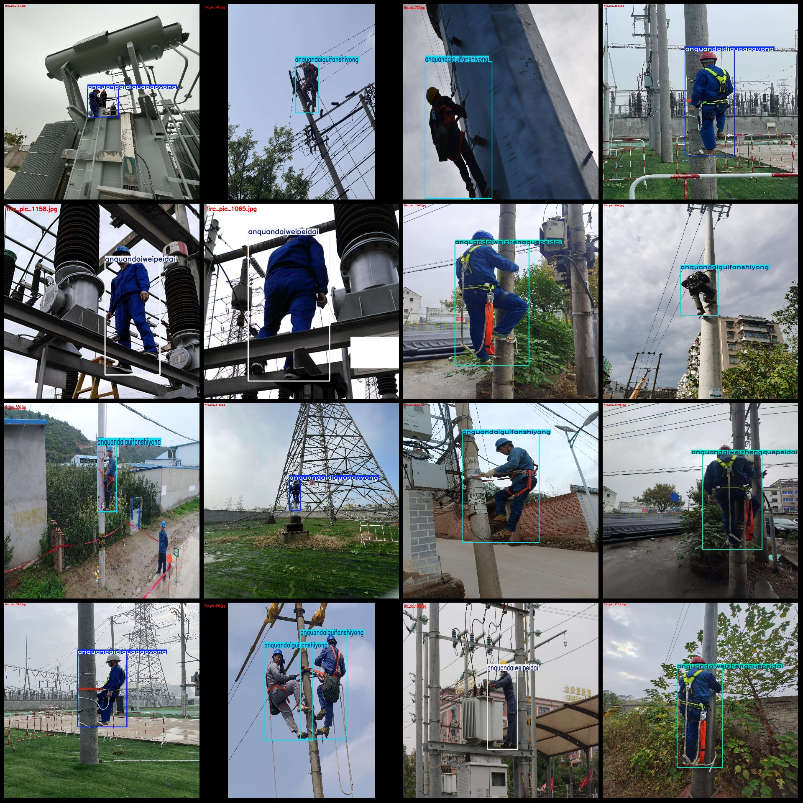
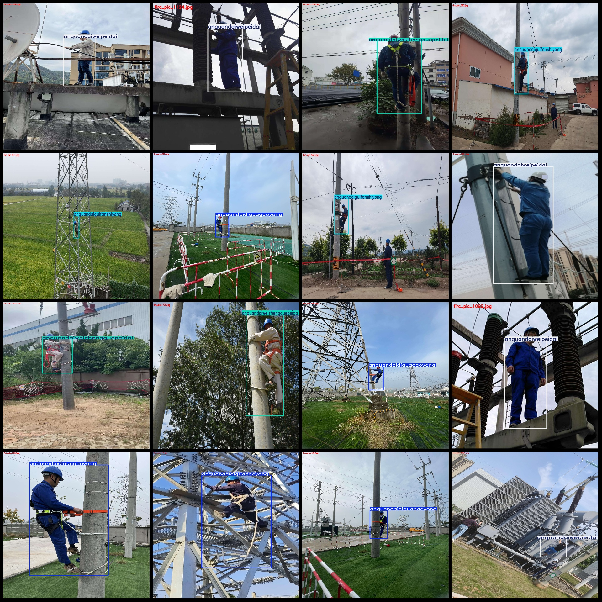

# Safety Belt Wearing Detection Dataset for Power Industry High-Altitude Work at Risk Identification in VOC+YOLO Format with 1998 Images and 4 Categories

Dataset format: Pascal VOC format+YOLO format (without split path in txtfile, only containing jpgimage and corresponding VOC format xmlfile and yolo format txtfile)
number of images: 1998  
annotation count: 1998  
annotation count: 1998  
annotationnumber of classes: 4  
Annotation class names (note that the order in the YOLO format is not consistent with this, but follows the labels file's classes.txt): ["anquandaidiguagaoyong", "anquandaiguifanshiyong", "anquandaiweipeidai", "anquandaiweizhengquepeidai"]
"Low hanging and high use of safety belt", "Safety belts should be used in a standard manner", "Safety belts are not worn", "Safety belts are not correctly worn"
boxes per class:   
anquandaidiguagaoyong box count = 500  
anquandaiguifanshiyong box count = 529  
anquandaiweipeidai box count = 513  
anquandaiweizhengquepeidai box count = 503  
total boxes: 2045  
images per class:   
anquandaidiguagaoyong images = 500  
anquandaiguifanshiyong images = 500  
anquandaiweipeidai images = 499  
anquandaiweizhengquepeidai images = 502  
image resolution: 1920x2560  
Use the annotation tool: labelImg
Annotation rules: draw a rectangle around the class
Important notes: The dataset does not have a training validation test set to be divided, it needs to be divided by oneself.
Special statement: This dataset does not guarantee the accuracy of the trained model or weight file.
image preview:
## Images

Here is a pay link on Stripe ( https://buy.stripe.com/3cs8yP7sY87d0vu9AB ). Please contact me lonlonago@foxmail.com after funding $89, and I will send you a complete data files , thank you!

